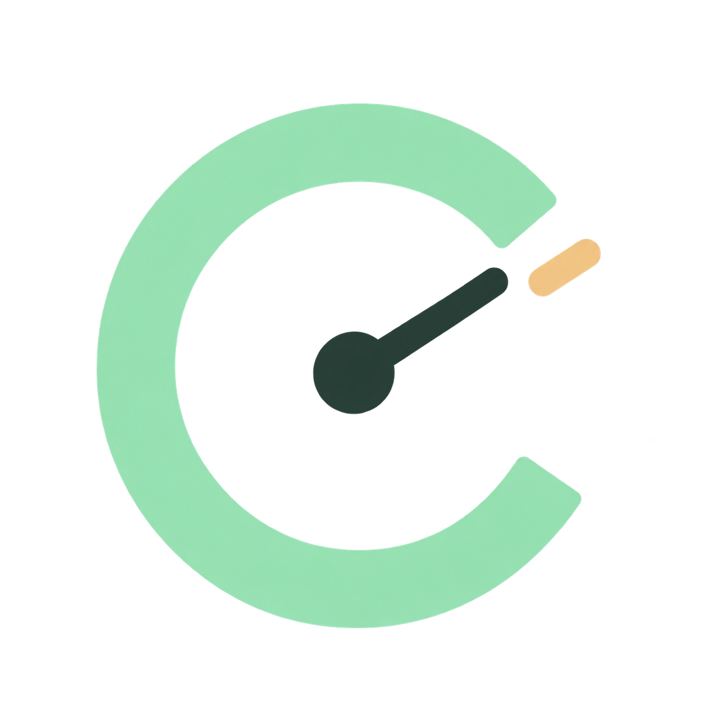

# Codex Meter



Een compacte Windows-app die laat zien hoeveel Codex-ruimte je nog hebt en wanneer je limieten worden gereset.

## Wat je ziet

- Resterende abonnementsruimte per limiet, als percentage.
- De datum en tijd van de reset, met een afteller.
- Extra credittegoed, wanneer Codex dat beschikbaar stelt.
- Een smal venster, een knop voor half scherm en een optie om bovenop te blijven.

De app ververst elke 30 seconden. De gegevens kunnen vanuit Codex vertraagd binnenkomen. Abonnementspercentages zijn geen vast aantal berichten of eurobedrag; extra credits worden afzonderlijk weergegeven.

## Zelf starten

Vereist Windows 11, Node.js met npm en een geïnstalleerde Codex-desktopapp met een actieve ChatGPT-aanmelding.

```powershell
npm install
npm start
```

Standaard zoekt de app `codex.exe` onder `%LOCALAPPDATA%\Programs\OpenAI\Codex\bin`. Voor een andere installatie kun je in PowerShell vóór het starten een pad instellen:

```powershell
$env:CODEX_METER_CLI = 'C:\pad\naar\codex.exe'
npm start
```

## Een Windows-appmap bouwen

```powershell
npm run check
npm run build:windows
```

Daarna staat `Codex Meter.exe` in de map `windows`. Bewaar die volledige map bij elkaar. Voor een bureaubladsnelkoppeling:

```powershell
powershell -NoProfile -ExecutionPolicy Bypass -File .\create-desktop-shortcut.ps1
```

De gebouwde appmap en testbeelden staan niet in de repository. De bouwstap gebruikt Electron uit `node_modules` en behoudt diens meegeleverde licentiebestanden.

## Gegevens en koppeling

De app vraagt alleen limietgegevens op via de lokale [Codex app-server](https://learn.chatgpt.com/docs/app-server). Er worden geen AI-prompts uitgevoerd. De app leest zelf geen wachtwoorden of tokens en bewaart geen verbruikshistorie. Bij verbindingsverlies blijven de laatste meting, het tijdstip en een foutmelding zichtbaar.

Dit is een persoonlijk project en geen officiële OpenAI-app.

## Nederlands / English

Gebruik de vlagknoppen **NL** en **EN** bovenin. De hele interface schakelt direct mee, inclusief resetdatums, aftellers, knoppen en foutmeldingen. Je keuze wordt lokaal onthouden na het herstarten. Nederlands is de standaardtaal.

Use the **NL** and **EN** flag buttons at the top to switch the entire interface, including reset dates, countdowns, controls and errors. Your choice is saved locally across restarts. Dutch is the default language.

### Een taal toevoegen / Adding another language

Fork dit project en voeg een vertaling toe aan `languages.js` met dezelfde sleutels als `en`. Geef `locale`, `name` en `hourUnit` op. Voeg in `index.html` een knop met `data-language="jouw-taalcode"` toe. Voeg eventuele vlagbestanden ook toe aan de bestandenlijst in `build-windows.cjs`. Ontbrekende teksten vallen terug op Engels.

To add a language in your fork, copy the English dictionary in `languages.js`, translate its values and set `locale`, `name` and `hourUnit`. Add a button with the matching `data-language` code in `index.html`. Include any new flag asset in `build-windows.cjs`. Missing strings fall back to English. No inactive “other language” button is shown.
